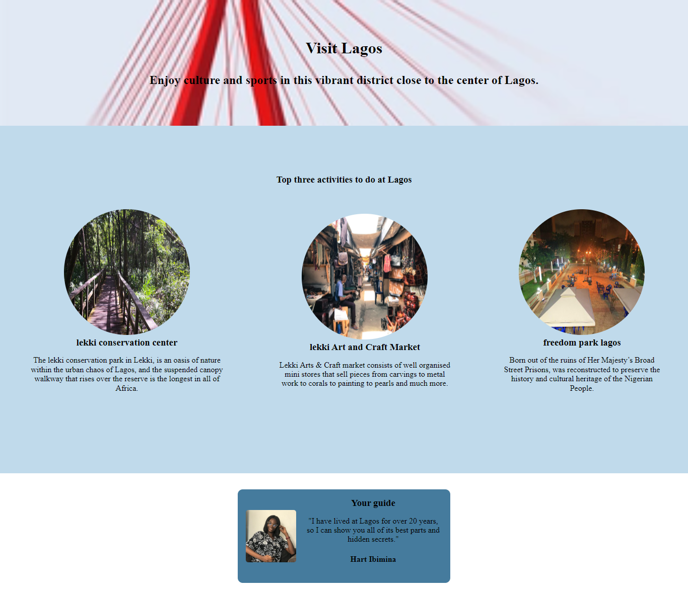

# Scrimba frontend learning Path

This is a solution to scrimba's A trip to Lagos

## Table of contents

- [Overview](#overview)
  - [The challenge](#the-challenge)
  - [Screenshot](#screenshot)
  - [Links](#links)
- [My process](#my-process)
  - [Built with](#built-with)
  - [Proud of this](#proud-of-this)
  - [Continued development](#continued-development)
- [Author](#author)

## Overview

### The challenge

Users should be able to:

- View the optimal layout for the site depending on their device's screen size

### Screenshot

### Links

- Solution URL: (https://github.com/ibimina/visit-lagos)
- Live Site URL: (https://ibimina.github.io/visit-lagos/)

## My process

### Built with

- Semantic HTML5
- CSS custom properties
- Flexbox
- Mobile-first workflow

### Continued development

Javascript and React framework

## Author

- Ibimina Hart
 - Frontend Mentor - [ibimina](https://www.frontendmentor.io/profile/ibimina)
 - Linkedin - [ibimina hart](https://www.linkedin.com/in/ibimina-hart)
- Twitter - [ibiminaaH](https://www.twitter.com/ibiminaaH)

